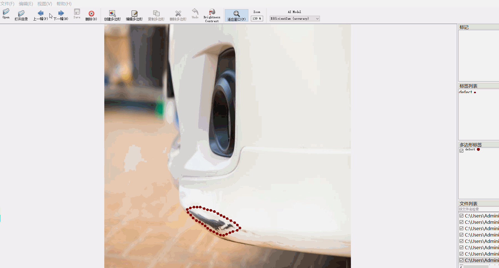

# Vehicle Defect Segmentation Dataset
4000 images in JSON format

The vehicle defect segmentation dataset consists of 4000 images in JSON format. The dataset is organized as follows: it includes only the JPG images and their corresponding JSON files without any mask files included.

Number of images (JPG file count): 4000

Number of annotations (JSON file count): 4000

Number of annotation categories: 1

Annotation category name: "defect"

Number of bounding boxes for each category:

- defect count = 8740

Total number of bounding boxes: 8740

Annotation tools used: labelme version 5.5.0

Repository location: firc-dataset

Image resolution: 640x640

Annotation rules: Polygons are drawn around the category labels.

Important Note: You can open and edit the dataset using labelme, but the JSON dataset must be converted into either a mask or YOLOF format for semantic segmentation or instance segmentation.

Special Remark: This dataset does not guarantee the accuracy of the trained models or weight files.

Annotation and image details are as follows:

## Images

---

Here is a pay link on Stripe (https://buy.stripe.com/3cs8yP7sY87d0vu9AB). Please contact me lonlonago@foxmail.com after funding $89, and I will send you a complete data files, thank you!

